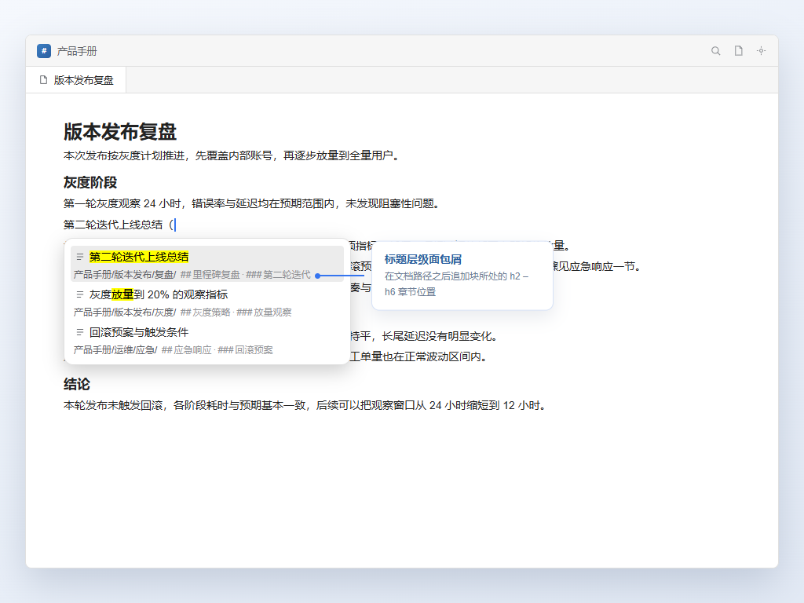

# 引用面包屑 (Ref Crumbs)

简体中文 | [English](README.md)

在思源的块引用搜索列表中显示每个块的标题层级链，一眼看出这个引用到底在文档的哪一节。



## 效果

思源的 `((` 搜索列表只显示每个结果所在的文档路径，看不到块在文档内部的层级位置。安装本插件后，标题层级会追加在同一行：

```
第二轮迭代上线总结
产品手册/版本发布/复盘/  ## 里程碑复盘 · ### 第二轮迭代
```

- 作用于 `((` 引用搜索列表，可选作用于搜索面板（默认关闭）
- 只取 h2 – h6，文档标题与路径中的文档名重复，不再显示
- 与文档路径同字号同灰阶，一行放不下时自动换行
- 标识符号（`##` / `h2` / `H₂` / 无）与连接符号（`·` `/` `-` `~` `>`）可配置

## 安装

- **集市** —— 设置 → 集市 → 插件，搜索「引用面包屑」
- **手动** —— 将 `dist/` 放入 `<工作空间>/data/plugins/ref-crumbs-siyuan/`，然后在设置 → 插件中启用

## 设置

设置 → 集市 → 引用面包屑。

| 选项 | 默认值 |
| --- | --- |
| 引用列表显示面包屑 | 开启 |
| 搜索列表显示面包屑 | 关闭 |
| 标题层级标识符号 | `##` |
| 标题层级连接符号 | `·` |

## 说明

- 需要思源 3.6.0 及以上版本，支持加密笔记本
- 纯前端插件：不修改内核，也不需要 SQL 权限

## 构建

```bash
npm install
npm run build
```

产物：`dist/`（插件包）与 `package.zip`（集市包）。

## 许可

MIT License，见 [LICENSE](./LICENSE)。
